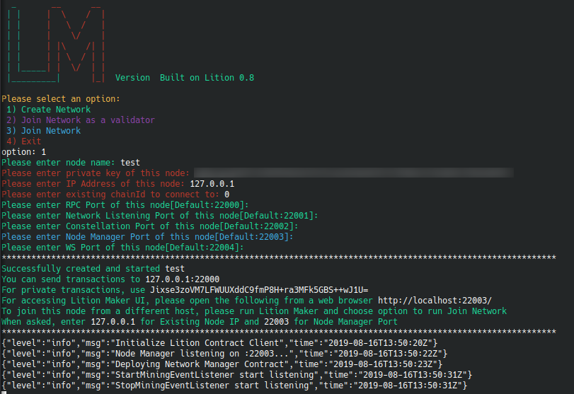
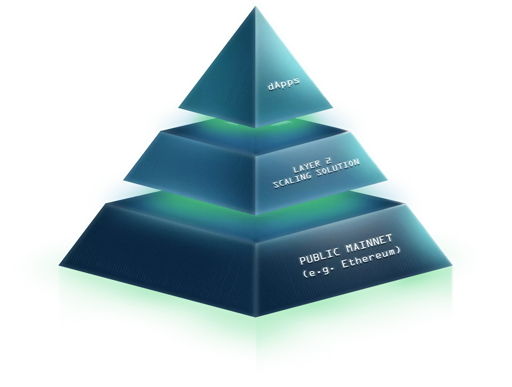

# Lition Maker V1.0

Lition Maker is a tool that allows users to create and manage Lition side chains networks. It is based on [Synechron's Quorum Maker](https://github.com/synechron-finlabs/quorum-maker).

Manually editing configuration files and creating nodes is a slow and error-prone process. Lition Maker can create any number of nodes of various configurations dynamically with reduced user input. This provides a wizard-like interface with a series of questions to guide the user when creating nodes. Lition Maker can create nodes to:

- run with docker-compose (BFT consensus/Lition 1.0.0) for easy use in development environments; or,
- nodes to be distributed on separate Linux boxes or cloud instances for a production environment (BFT consensus/Lition 1.0.0)


## Lition Maker provides the following benefits:

- An easy interface to create and manage the Lition Network
- A modern UI to monitor and manage Lition Network
- A Network Map Service to be used for identifying nodes and self-publishing roles.  
- Block and Transaction Explorer
- Smart Contract Deployment

## Quickstart

For quick help, run `./setup.sh --help` 

```
  _       __      __
 | |     |  \    /  |  
 | |     |   \  /   |  
 | |     |    \/    |  
 | |     | |\    /| |  
 | |     | | \  / | |  
 | |_____| |  \/  | |  
 |_________|      |_|  Version  Built on Lition 0.8


Usage ./setup.sh [COMMAND] [OPTIONS]

Utility to setup Lition Network

Commands:
create            Create a new Node. The node hosts Lition side chain, Constellation and Node Manager
join as validator Create a node and Join as validator to existing Lition side chain network
join              Create a node and Join to existing Lition side chain network

Options:

For create command:
  -n, --name              Name of the node to be created
  --ip                    IP address of this node (IP of the host machine)
  -r, --rpc               RPC port of this node
  -w, --whisper           Discovery port of this node
  -c, --constellation     Constellation port of this node
  --nm                    Node Manager port of this node
  --ws                    Web Socket port of this node
  -t, --tessera           Create node with Tessera Support (Optional)
  -pk|--privKey           Private key of node (Optional)
  -en|--ethnet            Ethereum network
  -cid|--chainId          Chain ID in Lition eht smart-contract to interact with
NOTE if key is not provided, node keys will be generated

E.g.
./setup.sh create -n master --ip 10.0.2.15 -r 22000 -w 22001 -c 22002 --nm 22003 --ws 22004 --ethnet ropsten --chainId 0

For join as validator command:
  -n, --name              Name of the node to be created
  --oip                   IP address of the other node (IP of the existing node)
  --onm                   Node Manager port of the other node
  --tip                   IP address of this node (IP of the host machine)
  -r, --rpc               RPC port of this node
  -w, --whisper           Discovery port of this node
  -c, --constellation     Constellation port of this node
  --nm                    Node Manager port of this node
  --ws                    Web Socket port of this node
  -t, --tessera           Create node with Tessera Support (Optional)
  -pk|--privKey           Private key of node (Optional)
  -en|--ethnet            Ethereum network
  -cid|--chainId          Chain ID in Lition eht smart-contract to interact with
NOTE if key is not provided, node keys will be generated

E.g.
./setup.sh join_as_validator -n slave1 --oip 10.0.2.15 --onm 22003 --tip 10.0.2.15 -r 22000 -w 22001 -c 22002 --nm 22003 --ws 22004 --ethnet ropsten --chainId 0

For join command:
  -n, --name              Name of the node to be created
  --oip                   IP address of the other node (IP of the existing node)
  --onm                   Node Manager port of the other node
  --tip                   IP address of this node (IP of the host machine)
  -r, --rpc               RPC port of this node
  -w, --whisper           Discovery port of this node
  -c, --constellation     Constellation port of this node
  --nm                    Node Manager port of this node
  --ws                    Web Socket port of this node
  -t, --tessera           Create node with Tessera Support (Optional)
  -pk|--privKey           Private key of node (Optional)
  -en|--ethnet            Ethereum network
  -cid|--chainId          Chain ID in Lition eht smart-contract to interact with
NOTE if key is not provided, node keys will be generated

E.g.
./setup.sh join -n slave1 --oip 10.0.2.15 --onm 22004 --tip 10.0.2.15 -r 22000 -w 22001 -c 22002 --nm 22003 --ws 22004 --ethnet ropsten --chainId 0

-h, --help              Display this help and exit
```

Example output:




## Further Reading
More information can be found in the [Lition whitepaper](https://www.lition.io/docs/Lition_Whitepaper_V1.10.0_public.pdf) section "The Blockchain Infrastructure", page 6-29.



## Official Docker Containers

The official docker containers can be found under https://cloud.docker.com/u/litiondev/repository/docker/litiondev/bc-lition

## References 
* [Documentation](https://gitlab.com/lition/lition-maker/wikis/home)
* [Lition](https://gitlab.com/lition/lition)
* [Istanbul BFT Consensus Documentation](https://github.com/ethereum/EIPs/issues/650)
* [Quorum](https://github.com/jpmorganchase/quorum)
* [Quorum Maker](https://github.com/synechron-finlabs/quorum-maker)


## License
Lition Maker is licensed under the [Apache License](LICENSE), also include in this repository in the `LICENSE` file